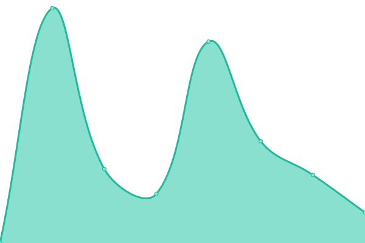
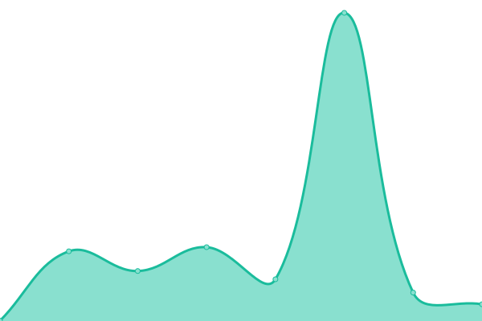
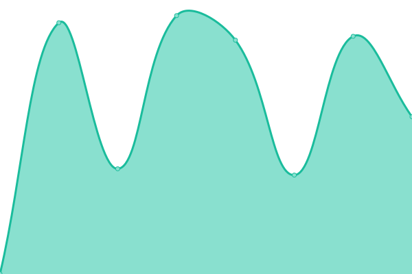

# [📈 Live Status](https://status.lucasboh.com): <!--live status--> **🟧 Partial outage**

This repository contains the open-source uptime monitor and status page for [lucasboh](lucasboh.com), powered by [Upptime](https://github.com/upptime/upptime).

With [Upptime](https://upptime.js.org), you can get your own unlimited and free uptime monitor and status page, powered entirely by a GitHub repository. We use [Issues](https://github.com/lucasboh/upptime/issues) as incident reports, [Actions](https://github.com/lucasboh/upptime/actions) as uptime monitors, and [Pages](https://status.lucasboh.com) for the status page.

<!--start: status pages-->
<!-- This summary is generated by Upptime (https://github.com/upptime/upptime) -->
<!-- Do not edit this manually, your changes will be overwritten -->
<!-- prettier-ignore -->
| URL | Status | History | Response Time | Uptime |
| --- | ------ | ------- | ------------- | ------ |
|  [Livieres Guggiari](https://livieresg.com.py) | 🟩 Up | [livieres-guggiari.yml](https://github.com/lucasboh/upptime/commits/HEAD/history/livieres-guggiari.yml) | 

 3816ms
     
 | 

<a href="https://status.estudioobliquo.com/history/livieres-guggiari">98.57%</a>
    

|  [Estudio TFZ](https://estudiotfz.com) | 🟩 Up | [estudio-tfz.yml](https://github.com/lucasboh/upptime/commits/HEAD/history/estudio-tfz.yml) | 

 410ms
     
 | 

<a href="https://status.estudioobliquo.com/history/estudio-tfz">100.00%</a>
    

|  [Allinea Pilates](https://allineapilates.com) | 🟥 Down | [allinea-pilates.yml](https://github.com/lucasboh/upptime/commits/HEAD/history/allinea-pilates.yml) | 

 1696ms
     
 | 

<a href="https://status.estudioobliquo.com/history/allinea-pilates">0.00%</a>
    

|  [Estudio Obliquo](https://estudioobliquo.com) | 🟩 Up | [estudio-obliquo.yml](https://github.com/lucasboh/upptime/commits/HEAD/history/estudio-obliquo.yml) | 

 401ms
     
 | 

<a href="https://status.estudioobliquo.com/history/estudio-obliquo">100.00%</a>
    

|  [Lucas Boh](https://lucasboh.com) | 🟩 Up | [lucas-boh.yml](https://github.com/lucasboh/upptime/commits/HEAD/history/lucas-boh.yml) | 

 1334ms
     
 | 

<a href="https://status.estudioobliquo.com/history/lucas-boh">100.00%</a>
    

|  [Survey Platform App](https://app.resonance-platform.org/) | 🟩 Up | [survey-platform-app.yml](https://github.com/lucasboh/upptime/commits/HEAD/history/survey-platform-app.yml) | 

 1053ms
     
 | 

<a href="https://status.estudioobliquo.com/history/survey-platform-app">100.00%</a>
    

|  [Survey Platform Strapi](https://strapi.resonance-platform.org/) | 🟩 Up | [survey-platform-strapi.yml](https://github.com/lucasboh/upptime/commits/HEAD/history/survey-platform-strapi.yml) | 

 609ms
     
 | 

<a href="https://status.estudioobliquo.com/history/survey-platform-strapi">100.00%</a>
    

<!--end: status pages-->

[**Visit our status website →**](https://status.lucasboh.com)

## 📄 License

- Powered by: [Upptime](https://github.com/upptime/upptime)
- Code: [MIT](./LICENSE) © [lucasboh](lucasboh.com)
- Data in the `./history` directory: [Open Database License](https://opendatacommons.org/licenses/odbl/1-0/)
