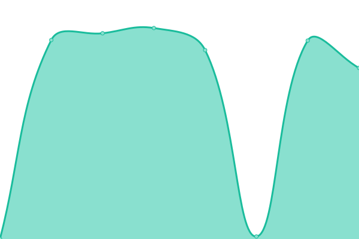

# [📈 Live Status](https://status.lucasboh.com): <!--live status--> **🟨 Degraded performance**

This repository contains the open-source uptime monitor and status page for [lucasboh](lucasboh.com), powered by [Upptime](https://github.com/upptime/upptime).

With [Upptime](https://upptime.js.org), you can get your own unlimited and free uptime monitor and status page, powered entirely by a GitHub repository. We use [Issues](https://github.com/lucasboh/upptime/issues) as incident reports, [Actions](https://github.com/lucasboh/upptime/actions) as uptime monitors, and [Pages](https://status.lucasboh.com) for the status page.

<!--start: status pages-->
<!-- This summary is generated by Upptime (https://github.com/upptime/upptime) -->
<!-- Do not edit this manually, your changes will be overwritten -->
<!-- prettier-ignore -->
| URL | Status | History | Response Time | Uptime |
| --- | ------ | ------- | ------------- | ------ |
|  [Livieres Guggiari](https://livieresg.com.py) | 🟩 Up | [livieres-guggiari.yml](https://github.com/lucasboh/upptime/commits/HEAD/history/livieres-guggiari.yml) | 

 1204ms
     
 | 

<a href="https://status.estudioobliquo.com/history/livieres-guggiari">100.00%</a>
    

|  [Sunshine Lettering](https://sunshineletteringpy.com) | 🟩 Up | [sunshine-lettering.yml](https://github.com/lucasboh/upptime/commits/HEAD/history/sunshine-lettering.yml) | 

 365ms
     
 | 

<a href="https://status.estudioobliquo.com/history/sunshine-lettering">100.00%</a>
    

|  [Delfina Zelaschi](https://delfinazelaschi.com) | 🟩 Up | [delfina-zelaschi.yml](https://github.com/lucasboh/upptime/commits/HEAD/history/delfina-zelaschi.yml) | 

 395ms
     
 | 

<a href="https://status.estudioobliquo.com/history/delfina-zelaschi">99.47%</a>
    

|  [GyL SRL](https://gylsrl.com.py) | 🟩 Up | [gy-l-srl.yml](https://github.com/lucasboh/upptime/commits/HEAD/history/gy-l-srl.yml) | 

 579ms
     
 | 

<a href="https://status.estudioobliquo.com/history/gy-l-srl">100.00%</a>
    

|  [De La Familia M](https://delafamiliam.com) | 🟩 Up | [de-la-familia-m.yml](https://github.com/lucasboh/upptime/commits/HEAD/history/de-la-familia-m.yml) | 

 431ms
     
 | 

<a href="https://status.estudioobliquo.com/history/de-la-familia-m">95.93%</a>
    

|  [Nextcloud](https://nube.lucasboh.com) | 🟩 Up | [nextcloud.yml](https://github.com/lucasboh/upptime/commits/HEAD/history/nextcloud.yml) | 

 384ms
     
 | 

<a href="https://status.estudioobliquo.com/history/nextcloud">100.00%</a>
    

|  [Estudio TFZ](https://estudiotfz.com) | 🟩 Up | [estudio-tfz.yml](https://github.com/lucasboh/upptime/commits/HEAD/history/estudio-tfz.yml) | 

 334ms
     
 | 

<a href="https://status.estudioobliquo.com/history/estudio-tfz">100.00%</a>
    

|  [Allinea Pilates](https://allineapilates.com) | 🟩 Up | [allinea-pilates.yml](https://github.com/lucasboh/upptime/commits/HEAD/history/allinea-pilates.yml) | 

 347ms
     
 | 

<a href="https://status.estudioobliquo.com/history/allinea-pilates">100.00%</a>
    

|  [Punto de Fuga](http://puntodefugapodcast.com) | 🟨 Degraded | [punto-de-fuga.yml](https://github.com/lucasboh/upptime/commits/HEAD/history/punto-de-fuga.yml) | 

 4073ms
     
 | 

<a href="https://status.estudioobliquo.com/history/punto-de-fuga">98.65%</a>
    

|  [Estudio Obliquo](https://estudioobliquo.com) | 🟩 Up | [estudio-obliquo.yml](https://github.com/lucasboh/upptime/commits/HEAD/history/estudio-obliquo.yml) | 

 472ms
     
 | 

<a href="https://status.estudioobliquo.com/history/estudio-obliquo">100.00%</a>
    

|  [Lucas Boh](https://lucasboh.com) | 🟩 Up | [lucas-boh.yml](https://github.com/lucasboh/upptime/commits/HEAD/history/lucas-boh.yml) | 

 395ms
     
 | 

<a href="https://status.estudioobliquo.com/history/lucas-boh">100.00%</a>
    

<!--end: status pages-->

[**Visit our status website →**](https://status.lucasboh.com)

## 📄 License

- Powered by: [Upptime](https://github.com/upptime/upptime)
- Code: [MIT](./LICENSE) © [lucasboh](lucasboh.com)
- Data in the `./history` directory: [Open Database License](https://opendatacommons.org/licenses/odbl/1-0/)
